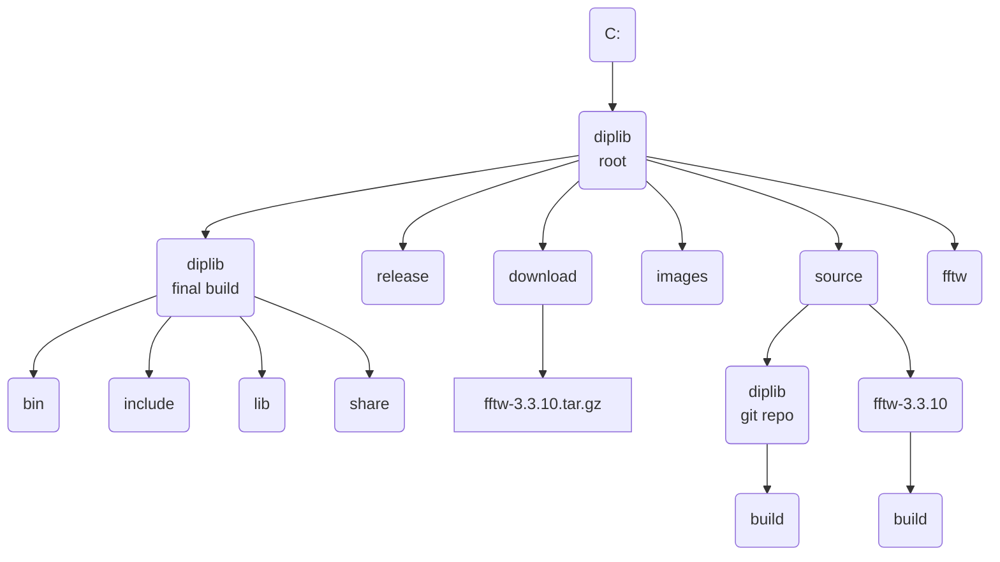
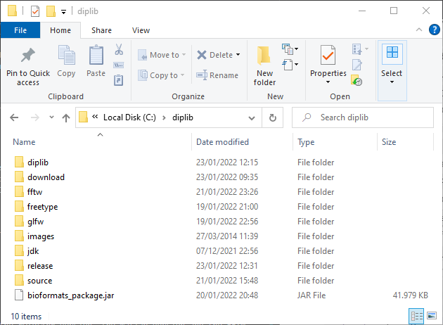
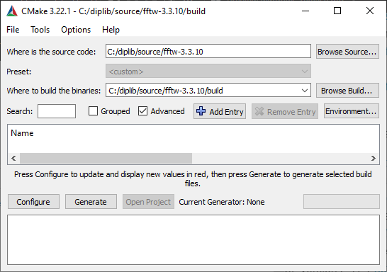
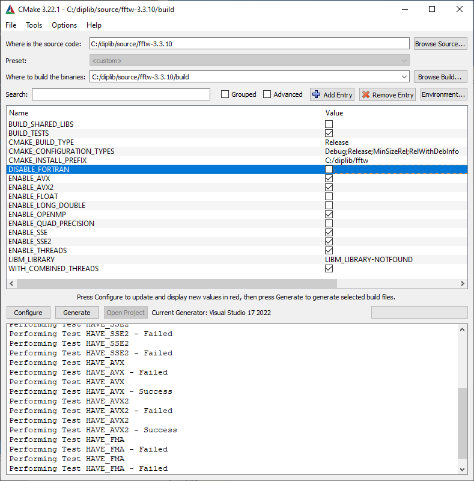
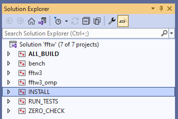
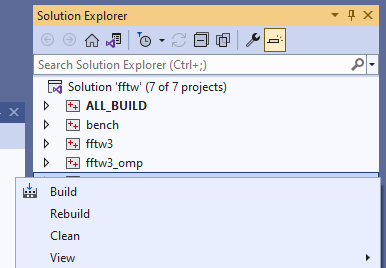

\comment Windows Release

\comment (c)2022, Ronald Ligteringen.

\comment Licensed under the Apache License, Version 2.0 [the "License"];
\comment you may not use this file except in compliance with the License.
\comment You may obtain a copy of the License at
\comment
\comment    http://www.apache.org/licenses/LICENSE-2.0
\comment
\comment Unless required by applicable law or agreed to in writing, software
\comment distributed under the License is distributed on an "AS IS" BASIS,
\comment WITHOUT WARRANTIES OR CONDITIONS OF ANY KIND, either express or implied.
\comment See the License for the specific language governing permissions and
\comment limitations under the License.

# Instructions for Windows release

*DIPlib* can be used as a C++ library linked to C++ code, via a Matlab interface and via a Python interface. The Python interface is build separately and is made available via PyPi. The Matlab interface (a.k.a. *DIPimage*) is build for macOS and Windows and is made available via GitHub Releases <https://github.com/DIPlib/diplib/releases>. Users are encouraged to build their own release of DIPlib and select which interface should be build for which platform. To aid with the build on Windows this document describes the steps taken for creating the release of the *DIPImage* for Windows.

## Setup file-structure

The following file-structure is used for building the Windows release (not all dependencies are specified, only FFTW is given as an example):

*Note: round corners indicate directories, sharp corners indicate files, second line is description*



### Explanation

- all software related to the build of the release is stored under `C:\diplib`
- all downloads are stored in `download`
- *DIPlib* images are stored in `images`
- all unpacked software sources are stored in `source`
- the CMake build directory `build` is created inside the unpacked source
- the compiled dependencies are stored with their package-name (no version)
- the *DIPimage* build is stored in `diplib`
- the *DIPimage* releases (the packed `diplib` build directory) are stored in `release`

Typically this would look something like this:



## Prerequisites

These instructions are written January 2022 and the following environment and programs have been used:
-. Windows 10 Enterprise, version 21H2
- Git, version 2.34.1 <https://git-scm.com/download/win>. Set global name and e-mail address in `Git Bash`:

   ```bash
   git config --global user.name "<Full name>"
   git config --global user.email "<e-mail address>"
   ```

- CMake, version 3.22.1 <https://cmake.org/download/#latest>
- Microsoft Visual Studio Community 2022 (64-bit), version 17.0.5 <https://visualstudio.microsoft.com/downloads/>. Select the C++ environment during installation
- OpenJDK, version 17.0.2 <https://jdk.java.net/17/>. It's sufficient to just unpack the `zip` file
- Matlab 2021b, version 9.11.0.1837725 <https://nl.mathworks.com/downloads>
- 7-Zip, version 21.07 <https://www.7-zip.org/download.html>. Used for unpacking `tar` (and `zip`)

Also the following dependencies have been downloaded:

- FFTW, version 3.3.10 <https://fftw.org/download.html>. Download the source as we will build our own static library (see [FFTW static library](#fftw-static-library))
- GLFW, version 3.3.6 <https://www.glfw.org/download.html>. Download the 64-bit Windows binaries as they contain a prebuild static library
- Freetype, version 2.11.1 <https://github.com/ubawurinna/freetype-windows-binaries/releases>. Download the `Source code (zip)` as is it contains a prebuild static library

For testing the *DIPlib* images are used:

- *DIPlib* images <https://ftp.imphys.tudelft.nl/DIPimage/images.zip>

### FFTW static library

To build the FFTW static libraries `Visual Studio` and `CMake` must be available.

For the FFTW library two versions need to be build: single precision `fftw3f.lib` and double precision `fftw3.lib` (for more information: <https://fftw.org/fftw3_doc/Precision.html>)

1. unpack the download source
1. start CMake and select the directory of the unpacked source which contains `CMakeLists.txt`
  
1. press the <kbd>Configure</kbd> button and confirm the creation of the build directory. In the next window the generator will show the just install `Visual Studio` version which can be confirmed with the `Finish` button.
1. for **double precision** set and unset the variables in the main window as follows:
   - `BUILD_SHARED_LIBS` unset
   - `CMAKE_INSTALL_PREFIX` `c:/diplib/fftw`
   - `ENABLE_AVX` set
   - `ENABLE_AVX2` set
   - `ENABLE_SSE` set
   - `ENABLE_SSE2` set
   - `ENABLE_THREADS` set
   - `WITH_COMBINED_THREADS` set
1. again press the <kbd>Configure</kbd> button to update the new values
  
1. press the <kbd>Generate</kbd> button to generate the build files for Visual Studio
1. close all running versions of Visual Studio and then press the <kbd>Open Project</kbd> button to start a new version of Visual Studio with the created build files
1. switch to Visual Studio and set the Solution Configuration to `Release`, see screenshot:
  
1. right-click on the `INSTALL` solution in the Solution Explorer and select `Build`, see screenshot:
  
  
1. return to CMake
1. for **single precision** only set the following variable:
   - `ENABLE_FLOAT` set
1. press the <kbd>Configure</kbd> button
1. press the <kbd>Generate</kbd> button
1. switch to Visual Studio and select the Reload option
1. right-click on the `INSTALL` solution

## Building *DIPimage*

The *DIPlib* source used for building *DIPimage* is retrieved from the GitHub-repository: <https://github.com/DIPlib/diplib>. [This document](windows_setup_git_ssh.md) describes briefly the steps to authenticate from Windows to GitHub with an ssh-keypair. All programs are installed and all dependencies are build and/or stored in the `diplib` root (see [Setup file-structure](#setup-file-structure)).

FFTW comes with the GNU General Public License, Version 2 which is not compatible with the *DIPlib* Apache License. Therefore two versions of *DIPimage* are created one with FFTW and one without reverting to the buildin FFT engine in *DIPlib*.

1. start CMake
1. configure the source directory `C:/diplib/source/diplib` and the build directory `C:/diplib/source/diplib/build`
1. check the Advanced box
1. press the <kbd>Configure</kbd> button
1. for *DIPimage* **with** FFTW set the variables in the main window as follows:
   - `CMAKE_INSTALL_PREFIX` `C:/diplib/diplib`
   - `FFTW3_INCLUDE_DIR` `C:/diplib/fftw/include`
   - `FFTW3_LIBRARY_FFTW3` `C:/diplib/fftw/lib/fftw3.lib`
   - `FFTW3_LIBRARY_FFTW3F` `C:/diplib/fftw/lib/fftw3f.lib`
   - `FREETYPE_INCLUDE_DIR_freetype2` `C:/diplib/freetype/include`
   - `FREETYPE_INCLUDE_DIR_ft2build` `C:/diplib/freetype/include`
   - `FREETYPE_LIBRARY_RELEASE` `C:/diplib/freetype/release static/vs2015-2022/win64/freetype.lib`
   - `GLFW_INCLUDE_DIR` `C:/diplib/glfw/include`
   - `GLFW_LIBRARY` `C:/diplib/glfw/lib-vc2022/glfw3.lib`
   - `JAVA_HOME` `C:/diplib/jdk` **NOTE: create this variable with the <kbd>+ Add Entry</kbd> button!**
   - `Matlab_ROOT_DIR` `C:/Program Files/MATLAB/R2021b`
1. press the <kbd>Generate</kbd> button
1. continue setting the variables:
   - `DIP_ENABLE_FFTW` set
   - `DIP_ENABLE_FREETYPE` set
   - `DIP_BUILD_JAVAIO` unset
1. press the <kbd>Generate</kbd> button
1. press the <kbd>Open Project</kbd> button
1. in Visual Studio check if Solution Configuration is set to `Release`
1. right-click on the `INSTALL` solution and select `Build`
1. check if the build runs by loading *DIPimage* in Matlab:

   ```matlab
   addpath('c:/diplib/diplib/share/DIPimage/')
   setenv('PATH',['C:\diplib\diplib\bin',';',getenv('PATH')]);
   dipsetpref('ImageFilePath', 'c:/diplib/images')
   dipimage
   a = readim('trui.ics','')
   b = ft(a,{},[])
   c = ift(b,{},[])
   viewslice(a)
   ```

1. close Matlab. This is **important** as to not lock the second build process below!
1. pack the complete `C:\diplib\diplib` build directory with the *DIPlib* version, the Matlab version and the FFTW set: `diplib_3.1_matlab2021b_fftw.zip`
1. return to CMake
1. for *DIPimage* **without** FFTW unset `DIP_ENABLE_FFTW`
1. press the <kbd>Generate</kbd> button
1. switch to Visual Studio and select the Reload option
1. right-click on the `INSTALL` solution and select `Build`
1. check if the build runs by loading *DIPimage* in Matlab (see above)
1. pack the build directory: `diplib_3.1_matlab2021b_nofftw.zip`
