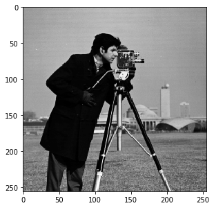

\comment (c)2017-2024, Cris Luengo.

\comment Licensed under the Apache License, Version 2.0 [the "License"];
\comment you may not use this file except in compliance with the License.
\comment You may obtain a copy of the License at
\comment
\comment    http://www.apache.org/licenses/LICENSE-2.0
\comment
\comment Unless required by applicable law or agreed to in writing, software
\comment distributed under the License is distributed on an "AS IS" BASIS,
\comment WITHOUT WARRANTIES OR CONDITIONS OF ANY KIND, either express or implied.
\comment See the License for the specific language governing permissions and
\comment limitations under the License.


\page pum_basics *PyDIP* basics

The *PyDIP* package is called `diplib`, and we recommend to import it as `dip`, which mirrors the
namespace used by the *DIPlib* library in C++:
```python
import diplib as dip
```


\section pum_basics_image The image object

Images are represented by an object of class `dip.Image`. The constructor has many different
syntaxes, the basic one takes as input the image sizes, the number of tensor elements (which is
our way to talk about channels), and the data type.
The image sizes are ordered x, y, z, etc. For a 2D image this means you pass (width, height).
```python
a = dip.Image((20, 10), 1, "UINT8")
a.Fill(3)
```
The number of tensor elements defaults to 1 (i.e. a grayscale image), and the data type defaults
to single-precision float.

Note that the image will not be initialized, the pixel values will be undefined. We used the
method `Fill()` to assign a constant value to the image.

Indexing into a `dip.Image` object works similarly to other array types in Python, but not identically.
The first index is x (horizontal), the second one is y (vertical), and the end value of the range
is included.
Note that `b` below is a view of `a` and shares the same data segment.
```python
b = a[4:-1, 0:4]
b.Fill(55)
a[:10, :3] = 100
a[10:15, 5:7] = 200
```
See \ref pum_indexing for more information.

Images can be displayed using the `Show()` method. `'normal'` sets the range to 0-255. Other
options are described in \ref pum_display. By default, the image is linearly stretched to the
minimum and maximum values.
```python
a.Show('normal')
```


!!! note ""
    It is necessary to install the `matplotlib` package separately for `Show()` to work. *PyDIP* uses
    `matplotlib` to display images, but it is not a package dependency, so will not be installed
    automatically when you install *DIPlib* from PyPI. *PyDIP* also has its own image display
    functionality, *DIPviewer*. This is an optional target when building the project.
    The official PyPI distribution will always have *DIPviewer* included. See \ref pum_display
    to learn how to use it.

Operators are generally applied on a per-pixel basis.
```python
m = a >= 100
m.Show()
```


Images can be indexed by binary images, resulting in a 1D image containing only the selected pixels.
```python
a[m].Show('normal')
```


Binary image indexing can also be used for assignment.
```python
a[m] = 176
a.Show('normal')
```


A `dip.Image` object uses the *NumPy* buffer interface. This means that you can use an `dip.Image` object
everywhere where you can use a *NumPy* array, and you can use a *NumPy* array anywhere where you
would use an `dip.Image` object.

Here we create a *NumPy* array and display it like it were a `dip.Image` (remember that *NumPy* uses
height as the first dimension and width as the second one, this is reverse from how *PyDIP* does it):
```python
import numpy as np
np.random.seed(0)
b = np.random.rand(a.Size(1), a.Size(0))
dip.Show(b)
```


Then we add the *NumPy* array to our image:
```python
a += 30 * b
a.Show()
```


Then we call a *NumPy* function with a `dip.Image` as input, and a *PyDIP* function with a *NumPy* array as input:
```python
np.mean(a)
dip.Mean(b)[0][0]
```
See \ref pum_numpy for more details.

Note that the `dip.Image` object can contain images of any number of dimensions, including 0 (a single pixel).
The `Show()` method only displays 1D or 2D images, for images with more dimensions, it will display a projection.
Read this method's help to learn how to control the projection mode, etc. Alternatively, use `dip.viewer.Show()`
for an interactive image display that shows images with any number of dimensions, see \ref pum_display.


\section pum_basics_loading Loading images from file

*PyDIP* has an image reading function `dip.ImageRead()`, which will use the built-in image readers
(ICS, TIFF, JPEG, PNG) and, if available, the *Bio-Formats* image reader (which recognizes over a hundred
different file types, see \ref pum_dipjavaio).
```python
a = dip.ImageRead('examples/cermet.ics')
a.Show()
```


It is also possible to use `imageio.v3.imread()`, `matplotlib.pyplot.imread()`, `cv2.imread()`, etc., which
all return a *NumPy* array that can be directly used by *PyDIP* functions, or converted into a `dip.Image` object.
```python
import matplotlib.pyplot as plt
b = dip.Image(plt.imread('examples/cameraman.tif'))
b.Show()
```



\section pum_basics_color Color images

Color images are supported too, it's a bit different from what you're likely used to.
A 2D color image is seen as 2D, each pixel has three values. This affects indexing!
Here we give a little demo, see \ref pum_tensor_images for more details.
```python
a = dip.ImageRead('examples/DIP.tif')  # This is an sRGB image
a[50:100, :]        # spatial indexing is the same as for a scalar 2D image
a(0)                # this is the red channel
a[128, 45]          # this returns a Python list with all the values for the pixel
a[128, 45][0]       # this returns the red value of one pixel
a(0)[128, 45]       # this also, but as a Python list
```

*PyDIP* knows a lot of color spaces. The Show method automatically converts to RGB for display.
```python
a.ColorSpace()  # == 'sRGB'
b = dip.ColorSpaceManager.Convert(a, 'Lab')
b.ColorSpace()  # == 'Lab'
b.Show()
```

```python
a(2).Show()  # B channel from RGB image
```

```python
b(2).Show()  # b channel from Lab image
```


\section pum_basics_filtering Filtering

There are many image filtering functions available, which you can discover by exploring the *DIPlib*
documentation. Function names and parameters in Python are identical to the names in the *DIPlib* library.
And just like in the *DIPlib* library, there exists a version of the function where the `out` parameter
is the return value. Here we do some simple color filtering to demonstrate.
```python
b = dip.Gauss(a, 5)
```
is the same as
```python
b = dip.Image()
dip.Gauss(a, out=b, sigmas=5)
```
The image `b` will be reforged (it gets a new data segment) if its properties are not correct.
This syntax is most useful when working in-place.

Note that the `out` argument must always be given as a keyword argument, and all subsequent arguments as well.
In the syntax that returns the output image, the keyword is optional.
```python
b.Show()
```


```python
b = dip.BilateralFilter(a, spatialSigmas=5, tonalSigma=30)
b.Show()
```


Some filters are specific for gray-value images (these are called "scalar images" everywhere in the documentation).
Here we apply such an image by first converting the image to gray scale.
```python
b = dip.ColorSpaceManager.Convert(b, 'gray')
dip.Canny(b, upper=0.99).Show()
```


See \ref pum_filtering for more details about input and output arguments to *DIPlib* function calls.


\section pum_basics_measurement Measurement

`dip.MeasurementTool` can measure quite a lot of features for objects in an image, see \ref dip::MeasurementTool.
This is a simple example usage.

We first read the 'cermet' image, and record its pixel size (this is an old example image, the actual pixel size
has gotten lost over the years). If an image file contains the pixel size in the metadata, it will automatically
be recorded in the `dip.Image` object and used by measurement functions and some other functions.
Note that pixels do not need to be isotropic, it is possible to give a different pixel size for each dimension.
```python
a = dip.ImageReadICS('examples/cermet.ics')
a.SetPixelSize(1, "um")  # "um" is easier to type than "μm", but they mean the same thing
a.Show()
```


Next, we threshold and label the image, then measure some basic features. Because 'Solidity' depends on the
'ConvexArea' measurement, we get that one too in the output.
```python
b = a < 120
b = dip.EdgeObjectsRemove(b)
b = dip.Label(b, minSize=30)
m = dip.MeasurementTool.Measure(b, a, ['Size', 'Solidity', 'Statistics'])
print(m)
```
```none
   |       Size |   Solidity |                                            Statistics | ConvexArea |
-- | ---------- | ---------- | ----------------------------------------------------- | ---------- |
   |            |            |       Mean |     StdDev |   Skewness | ExcessKurtosis |            |
   |      (μm²) |            |            |            |            |                |      (μm²) |
-- | ---------- | ---------- | ---------- | ---------- | ---------- | -------------- | ---------- |
 1 |      262.0 |     0.9668 |      45.34 |      30.82 |     0.7216 |        -0.6831 |      271.0 |
 2 |      63.00 |     0.9474 |      86.35 |      13.41 |     0.2313 |        -0.5471 |      66.50 |
 3 |      243.0 |     0.9293 |      75.09 |      21.16 |     0.1711 |        -0.9723 |      261.5 |
 4 |      209.0 |     0.9698 |      61.63 |      25.80 |     0.3937 |        -0.7994 |      215.5 |
 5 |      462.0 |     0.9665 |      62.10 |      20.27 |     0.7329 |         0.1613 |      478.0 |
 6 |      611.0 |     0.9745 |      81.17 |      17.92 |    -0.3812 |        -0.2219 |      627.0 |
<snip>
```

The `dip.Measurement` object `m` can be indexed in three levels: the measurement name ('Statistics'),
the object number (30), and the measurement value within the selected measurement (2):
```python
m['Statistics'][30]     # returns a list with the four statistics values
m['Statistics'][30][2]  # returns a float
m[30]['Statistics'][2]  # identical to the above, the order of the two first indices is irrelevant
```

Leaving out one of the indices returns the full row or column:
```python
print(m[30])
print(m['Solidity'])
```
These objects can be indexed further as above, or be converted to a NumPy array:
```python
np.asarray(m[30])  # returns a 2D NumPy array for a single row of the measurement table
np.asarray(m['Solidity'])  # returns a 2D NumPy array for a column
```

See \ref pum_measurement for a more in-depth look at the measurement object.
