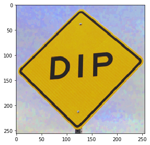
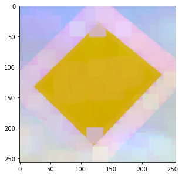
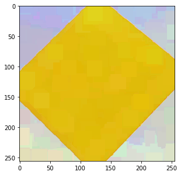

\comment (c)2017-2024, Cris Luengo.

\comment Licensed under the Apache License, Version 2.0 [the "License"];
\comment you may not use this file except in compliance with the License.
\comment You may obtain a copy of the License at
\comment
\comment    http://www.apache.org/licenses/LICENSE-2.0
\comment
\comment Unless required by applicable law or agreed to in writing, software
\comment distributed under the License is distributed on an "AS IS" BASIS,
\comment WITHOUT WARRANTIES OR CONDITIONS OF ANY KIND, either express or implied.
\comment See the License for the specific language governing permissions and
\comment limitations under the License.


\page pum_filtering Filtering

This section goes into details on using *PyDIP* functions.

To find a function in the documentation, type **T**{ .m-label .m-warning } here (or click the
search icon at the top of the page) to bring up a search dialog box. There you can search for
functions, modules and pages by name. For example, typing "watershed" in the search box
will point you to a series of functions related to the watershed.

The signature of functions are mostly the same in the Python package as they are in the C++ library.
Most *DIPlib* types exist in *PyDIP* as well, but a few types are translated to Python types,
see \ref pum_differences_correspondences.

Most *DIPlib* functions have two function signatures, the documentation will always list only
one of them. The difference is the parameter called `out`, if it's an image. There is a second
function signature where this parameter is left out, and the function returns the output image.
This alternative function signature is usually easier to use, and most example *PyDIP* code
will use it.

\section pum_filtering_example A simple example

Let's look at that watershed example. First look at the documentation for \ref dip::Watershed.
The function has three image arguments: `in`, `mask` and `out`. We can make `out` be the output
argument. An image called `mask` is always a binary image, and usually optional (even if the
documentation doesn't say so explicitly as in this case). We can pass `None` to represent
"no image" (where in C++ you'd use a raw image).

So we can call it with:
```python
img = dip.ImageRead('examples/cermet')
out = dip.Watershed(img, None, maxDepth=40)
```
But `None` in this case is the default for the `mask` argument, so we can simplify further as
```python
out = dip.Watershed(img, maxDepth=40)
```

The default values are always the same as they are in the documentation.


\section pum_filtering_outarg The `out` argument

Sometimes you want an operation to write its output in a pre-allocated buffer. This is when the
`out` input argument is useful:
```python
out = dip.Image(img.Sizes(), 1, "BIN")
dip.Watershed(img, out=out, maxDepth=40)
```

Here, `dip.Watershed()` can write its output in the existing `out` image, and will not reforge it
(reallocate its data segment) or change its properties.

But in principle it is not necessary to get the properties right. If the image passed for `out`
has the wrong sizes, number of tensor elements or data type, then it will be reforged to be
correct:
```python
out = dip.Image((10, 20), 3, "SINT32")
dip.Watershed(img, out=out, maxDepth=40)
print(out)  # will show how the image now is 256x256, scalar and binary
```


\section pum_filtering_protect The protect flag

When a function is able to reforge the `out` image, it is not always clear why we should bother
with it. Can we ever be sure that the image will not be reforged? Yes! We can protect the
data segment, preventing the image from being reforged.
```python
out = dip.Image((10, 20), 3, "SINT32")
out.Protect()
dip.Watershed(img, out=out, maxDepth=40)  # raises an exception, because the result cannot be written into out
```

The protect flag is useful when an image encapsulates data from a different source, and we want to
ensure we overwrite that data.

It is also useful to change the output data type of a filter.
For example, \ref dip::Gauss will produce a single-precision floating-point image as output by default.
But we can force it to produce an output of a different type:
```python
out = dip.Image()
out.SetDataType('UINT8')
out.Protect()
dip.Gauss(img, out=out, sigmas=5)
```
Here, `out` was not forged (we never gave sizes, we only specified the data type). But by setting the
protect flag, we indicated to `dip.Gauss()` not to change its data type, forcing the function to
produce a 8-bit unsigned integer output.

Finally, the protect flag is useful to have a function work in-place. For example:
```python
dip.Gauss(img, out=img, sigmas=5)
```
Without protecting `img`, `dip.Gauss` will reforge its output image, meaning that `img` is now
an `'SFLOAT'` image, no longer a `'UINT8'` as it was before calling the function. The filter didn't work
in place, it reforged `img` after keeping a reference to the original data segment to be used as input
to the computation. But if we protect the image before applying the filter, this is no longer the case:
```python
img.Protect()
dip.Gauss(img, out=img, sigmas=5)
img.Protect(False)     # reset the protect flag
```
In this case, `img` is not reforged, and the filter works in-place. `img` still points to the same
data segment as it did before the filter was applied.

Note that some functions cannot work in-place. If they receive the same image as input and output,
they will first copy the input data before doing the computations that write to the output. To the
user it looks like the operation is working in-place, but in reality there's a temporary copy being made.


\section pum_filtering_color Filtering color images

With some functions, like `dip.Gauss()`, we can process color images normally. However, many functions
require a scalar (gray-scale) image as input. This is mostly the case for functions where it doesn't
make sense to work on color (for example `dip.Watershed()`), or where the operation is ambiguous on
color (for example `dip.Dilation()`). We'll use this latter function as an example.

Let's start with an example color image:
```python
img = dip.ImageRead('examples/DIP.tif')
img.Show()
```



If we try to apply a dilation to this image, we get an exception:
```python
se = dip.SE(25, "rectangular")
dip.Dilation(img, se=se)  # raises exception with text "Image is not scalar"
```

The dilation computes a local maximum, and the maximum over a set of RGB values is not uniquely defined,
there's no unique, correct way to order colors (not in RGB space, not in any other color space).

One approach is to apply the dilation to each channel independently:
```python
res = img.Similar()
for ii in range(img.TensorElements()):
    dip.Dilation(img(ii), out=res(ii), se=se)
res.Show()
```



This is called "marginal ordering", and can introduce new colors into the image. The maximum of yellow,
sky blue and black apparently is pinkish.

Another approach is to sort pixels on intensity only, or on some other property. Then the dilation picks
the pixel that has the largest value of this property. For example, we can determine the distance to
pure yellow, and sort pixels based on that value. \ref dip::SelectionFilter is a dilation of sorts,
it picks pixels from one image based on the intensities of another (scalar) image:
```python
select = -dip.Norm(img - [255, 255, 0])  # negate the distance, so that yellow gets larger values
res = dip.SelectionFilter(img, select, kernel=dip.Kernel(25, "rectangular"), mode="maximum")
res.Show()
```



Now we see that the yellow area has grown over the other colors, as one would expect for a dilation.
