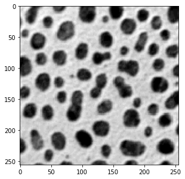
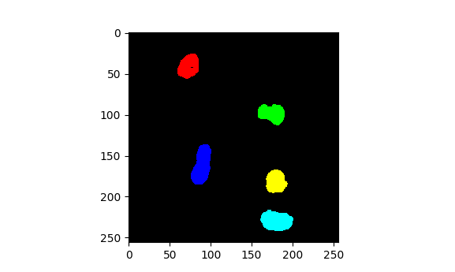
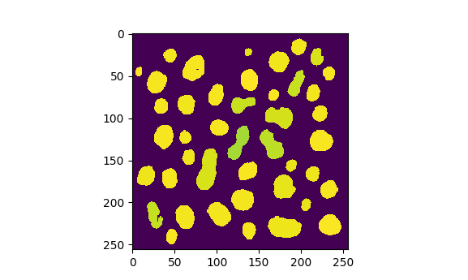
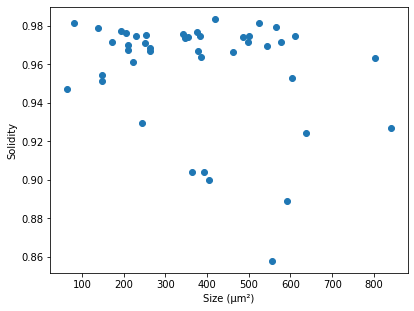

\comment (c)2017-2024, Cris Luengo.

\comment Licensed under the Apache License, Version 2.0 [the "License"];
\comment you may not use this file except in compliance with the License.
\comment You may obtain a copy of the License at
\comment
\comment    http://www.apache.org/licenses/LICENSE-2.0
\comment
\comment Unless required by applicable law or agreed to in writing, software
\comment distributed under the License is distributed on an "AS IS" BASIS,
\comment WITHOUT WARRANTIES OR CONDITIONS OF ANY KIND, either express or implied.
\comment See the License for the specific language governing permissions and
\comment limitations under the License.


\page pum_measurement Measurement

`dip.MeasurementTool` can measure quite a lot of features for objects in an image, see \ref dip::MeasurementTool
for a full list. To demonstrate, we'll start with a simple example image that we can measure: the 'cermet' image.
Because the file doesn't have pixel size information embedded, we'll invent a pixel size. The pixel size is
attached to the image, and taken into account by many functions in the *DIPlib* library. `dip.MeasurementTool`
reports measurements in physical units instead of pixels if the image has pixel size information.
Note that pixels do not need to be isotropic, it is possible to give a different pixel size for each dimension.
```python
gray = dip.ImageReadICS('examples/cermet.ics')
gray.SetPixelSize(1, "um")  # "um" is easier to type than "μm", but they mean the same thing
gray.Show()
```


Next, we threshold and label the image, then measure some basic features. Because 'Solidity' depends on the
'ConvexArea' measurement, we get that one too in the output. 
```python
bin_img = gray < 120
label = dip.Label(bin_img, minSize=30)
label = dip.EdgeObjectsRemove(label)
measurement = dip.MeasurementTool.Measure(label, gray, ['Size', 'Solidity', 'Statistics'])
print(measurement)
```
```none
   |       Size |   Solidity |                                            Statistics | ConvexArea | 
-- | ---------- | ---------- | ----------------------------------------------------- | ---------- | 
   |            |            |       Mean |     StdDev |   Skewness | ExcessKurtosis |            | 
   |      (μm²) |            |            |            |            |                |      (μm²) | 
-- | ---------- | ---------- | ---------- | ---------- | ---------- | -------------- | ---------- | 
 6 |      262.0 |     0.9668 |      45.34 |      30.82 |     0.7216 |        -0.6831 |      271.0 | 
 7 |      63.00 |     0.9474 |      86.35 |      13.41 |     0.2313 |        -0.5471 |      66.50 | 
 8 |      243.0 |     0.9293 |      75.09 |      21.16 |     0.1711 |        -0.9723 |      261.5 | 
 9 |      209.0 |     0.9698 |      61.63 |      25.80 |     0.3937 |        -0.7994 |      215.5 | 
10 |      462.0 |     0.9665 |      62.10 |      20.27 |     0.7329 |         0.1613 |      478.0 | 
11 |      611.0 |     0.9745 |      81.17 |      17.92 |    -0.3812 |        -0.2219 |      627.0 | 
12 |      80.00 |     0.9816 |      83.10 |      15.72 |     0.1468 |        -0.7721 |      81.50 | 
13 |      205.0 |     0.9762 |      52.92 |      32.19 |     0.1556 |         -1.183 |      210.0 | 
14 |      419.0 |     0.9836 |      41.60 |      30.24 |     0.8653 |        -0.3741 |      426.0 | 
15 |      363.0 |     0.9041 |      71.56 |      22.25 |    -0.2541 |        -0.5946 |      401.5 | 
16 |      487.0 |     0.9740 |      57.81 |      25.17 |    0.05945 |        -0.4846 |      500.0 | 
17 |      383.0 |     0.9746 |      53.10 |      24.60 |     0.6360 |        -0.3009 |      393.0 | 
18 |      250.0 |     0.9709 |      50.21 |      30.08 |     0.6251 |        -0.8159 |      257.5 | 
20 |      137.0 |     0.9786 |      64.47 |      22.41 |     0.5215 |        -0.8983 |      140.0 | 
21 |      378.0 |     0.9668 |      64.85 |      21.35 |     0.3866 |        -0.5561 |      391.0 | 
22 |      392.0 |     0.9043 |      48.06 |      31.20 |     0.4776 |        -0.8514 |      433.5 | 
23 |      230.0 |     0.9746 |      70.43 |      23.68 |    -0.2813 |        -0.6269 |      236.0 | 
25 |      262.0 |     0.9686 |      62.26 |      25.31 |     0.3051 |        -0.7452 |      270.5 | 
26 |      637.0 |     0.9245 |      52.94 |      23.86 |     0.8441 |       -0.08530 |      689.0 | 
28 |      341.0 |     0.9757 |      54.94 |      25.06 |     0.8843 |        -0.3705 |      349.5 | 
29 |      501.0 |     0.9747 |      51.85 |      24.15 |     0.9221 |       -0.05920 |      514.0 | 
30 |      556.0 |     0.8580 |      60.65 |      22.53 |     0.5287 |        -0.3121 |      648.0 | 
31 |      592.0 |     0.8889 |      58.28 |      29.00 |     0.1195 |         -1.026 |      666.0 | 
32 |      172.0 |     0.9718 |      68.47 |      23.14 |     0.3064 |        -0.9392 |      177.0 | 
33 |      566.0 |     0.9792 |      41.71 |      30.85 |     0.7348 |        -0.5709 |      578.0 | 
35 |      842.0 |     0.9268 |      53.14 |      26.75 |     0.1291 |        -0.4931 |      908.5 | 
37 |      209.0 |     0.9676 |      56.00 |      26.01 |     0.5350 |        -0.8241 |      216.0 | 
38 |      147.0 |     0.9545 |      65.14 |      24.51 |     0.3733 |        -0.9707 |      154.0 | 
39 |      375.0 |     0.9766 |      71.89 |      21.69 |    0.06353 |        -0.7623 |      384.0 | 
40 |      385.0 |     0.9637 |      51.05 |      27.73 |     0.6729 |        -0.5471 |      399.5 | 
41 |      223.0 |     0.9612 |      63.78 |      25.31 |     0.1825 |        -0.4636 |      232.0 | 
42 |      347.0 |     0.9734 |      55.33 |      26.30 |     0.5900 |        -0.7111 |      356.5 | 
43 |      604.0 |     0.9527 |      50.44 |      26.84 |     0.6709 |        -0.5829 |      634.0 | 
44 |      354.0 |     0.9739 |      42.53 |      33.74 |     0.6403 |        -0.9280 |      363.5 | 
45 |      543.0 |     0.9696 |      50.64 |      24.14 |      1.068 |         0.3071 |      560.0 | 
47 |      147.0 |     0.9515 |      67.05 |      22.61 |     0.2393 |        -0.5154 |      154.5 | 
48 |      405.0 |     0.9000 |      83.24 |      23.60 |    -0.9721 |      0.0003058 |      450.0 | 
49 |      577.0 |     0.9714 |      30.64 |      31.71 |      1.246 |         0.2249 |      594.0 | 
50 |      497.0 |     0.9717 |      61.73 |      18.86 |      1.101 |         0.3655 |      511.5 | 
52 |      525.0 |     0.9813 |      34.06 |      31.89 |      1.047 |        -0.1825 |      535.0 | 
53 |      803.0 |     0.9634 |      54.23 |      25.55 |     0.4471 |        -0.5974 |      833.5 | 
54 |      253.0 |     0.9750 |      59.83 |      25.32 |     0.4961 |        -0.8077 |      259.5 | 
55 |      193.0 |     0.9772 |      65.91 |      23.49 |     0.4554 |        -0.8702 |      197.5 | 
```


\section pum_measurement_information Information about the measurement object

The leftmost column of the table above shows the object IDs (labels) of the measured objects. This list can
be obtained with `measurement.Objects()`. Note that `dip.EdgeObjectsRemove` removed some labeled objects,
those labels are not in the list.

The column group headers (features), and some information about them, can be obtained with `measurement.Features()`,
which returns a list that tells us the name and the number of columns for each feature.
`measurement.Values()` also returns a list, but it has an element for each column (not column group), and
tells us the name of the value (only for multi-value features) and the units that the value is in.

To query the size of the measurement object, use `measurement.NumberOfObjects()` (which is the same as
`len(measurement)`), `measurement.NumberOfFeatures()` and `measurement.NumberOfValues()`. One can query
if a specific feature was measured with `measurement.FeatureExists()`, and if a specific objects was
measured with `measurement.ObjectExists()`.


\section pum_measurement_indexing Indexing into the measurement object

The `dip.Measurement` object `measurement` can be indexed in three levels: the measurement name ('Statistics'),
the object number (30), and the measurement value within the selected measurement (2):
```python
measurement['Statistics'][30]     # returns a list with the four statistics values
measurement['Statistics'][30][2]  # returns a float
measurement[30]['Statistics'][2]  # identical to the above, the order of the two first indices is irrelevant
```

Leaving out one of the indices returns the full row or column:
```python
row = measurement[30]
col = measurement['Solidity']
```

These objects can be used in many different ways. Both have the same methods as the `measurement`
object has, or rather the subset that makes sense: For the column we can query about objects:
`col.Objects()`, `col.NumberOfObjects()` and `col.ObjectExists()`. For the row we can query about
features and values: `row.Features()`, `row.Values()`, `row.NumberOfFeatures()`, `row.NumberOfValues()`
and `row.FeatureExists()`.

Additionally, we have `row.ObjectID()` and `col.FeatureName()` to find out which row and which column
is indexed.

These objects also mimic the functionality of a dictionary: they both have a `keys()` method,
a `values()` method, and an `items()` method. These methods do copy the data, so they are less efficient
to use. But they can be very useful. Additionally, `iter()` and `len()` have been overloaded. This
means that one can iterate over a row or column:
```python
t = 0
for s in col:
    t += s[0]

for s in row:
    print(s)
```

As we'll see below, there are also some functions that take a column of measurements as input.

Because a feature can have multiple values, something like `measurement['Statistics']` doesn't
represent a single value per object. The `Subset()` method can be used to select a single
column. It modifies the object to be a single value:
```python
col = measurement['Statistics']
col.Subset(1)
col.Values()  # Shows that we only have one column, the 'StdDev' one.
```


\section pum_measurement_statistics Statistics on measurements

There exist various statistics functions that can be applied to a measurement column:
```python
dip.Maximum(measurement['Solidity'])        # the largest solidity value
dip.MaximumObject(measurement['Solidity'])  # the object ID for the largest solidity value
dip.SampleStatistics(measurement['Solidity'])
```
These functions all return the statistics for the first column in the column group, use
`Subset()` (see \ref pum_measurement_indexing "above") to select which column to apply the statistics to.

See under "related" on \ref dip::Measurement::IteratorFeature "this page" for a full
list of functions available.

Because a measurement column object is accepted as input by NumPy functions, there are
many other statistics that can be applied (see \ref pum_measurement_numpy).


\section pum_measurement_selection Selecting measurement rows

Comparison operators applied to a colum produce a \ref dip::LabelMap "`dip.LabelMap`" object. This
is an object that can be used to index into a measurement object to select rows. For example,
to select all the objects over 600 μm²:
```python
selection = measurement['Size'] > 600
large_objects = measurement[selection]
large_objects.NumberOfObjects()        # equal to 5
```
`selection.Count()` is also 5.

The operation is always applied to the first value of a multi-valued feature. Use `Subset()`
\ref pum_measurement_indexing "as discussed above" to select which value to apply the operation to.

One can combine multiple `LabelMap` objects together using element-wise Boolean operators `&`, `|` and `^`.
Also the unary element-wise negation operator `~` can be used. But be aware of the precendence
of these operators in Python

In this `LabelMap` object, each label (object ID) is mapped to a new value.
Those labels mapped to 0 are the rows that will be removed when the mapping is applied to a measurement
object (which we did with `measurement[selection]`). The other labels all map to themselves by default.
One can use indexing to examine and update the mapping.

For example:
```python
large_objects.Objects()  # is [11, 26, 35, 43, 53]

selection[11] = 1
selection[26] = 0
large_objects = measurement[selection]
large_objects.Objects()  # is [1, 35, 43, 53]
```
We re-labeled object 11 as 1, and we explicitly deselected object number 26.

`selection.Relabel()` causes the selected rows to be relabeled with contiguous labels starting at 1:
```python
selection.Relabel()
large_objects = measurement[selection]
large_objects.Objects()  # is [1, 2, 3, 4]
```

Applying the `LabelMap` to the label image that the measurement was taken from is a simple way to
select objects with specific properties:
```python
selection = measurement['Size'] > 600
selection.Relabel()  # optional
large_object_image = selection.Apply(label)
large_object_image.Show('labels')
```



\section pum_measurement_numpy Converting measurements to a NumPy array

The measurement object can be converted to a NumPy array, which will have the same
layout as the measurement object as shown by `print()`. This array will share data
with the measurement object, modifying it will modify the measurement object.

```python
array = np.asarray(measurement)
array[0, 0] = 0
measurement['Size'][6]  # will print [0.0]
```

Also a partially-indexed measurement object can be converted to a NumPy array,
again sharing data:
```python
np.asarray(measurement[30])  # returns a 2D NumPy array for a single row of the measurement table
np.asarray(measurement['Solidity'])  # returns a 2D NumPy array for a column group
```

But note that it is not always necessary to explicitly convert to a NumPy array, one
can directly call NumPy functions on these objects:
```python
np.max(measurement['Solidity'])
```
Casting to an array might be useful to call a function that expects its input to have
a `shape` property.


\section pum_measurement_other Other ways to use measurements

We can paint the objects with one of the measurements, which can be useful for display:
```python
solidity = dip.ObjectToMeasurement(label, measurement['Solidity'])
solidity.Show(colormap='viridis')
```


Casted to a NumPy array, measurement columns can be the input to plotting functions.
Here we plot size vs solidity:
```python
import matplotlib.pyplot as plt
plt.scatter(np.asarray(measurement['Size']), np.asarray(measurement['Solidity']))
plt.xlabel('Size (μm²)')
plt.ylabel('Solidity')
```


If you use Pandas, you can convert the measurement object to a Data Frame:
```python
df = measurement.ToDataFrame()
print(df)
```
```none
     Size  Solidity  Statistics, Mean  Statistics, StdDev  Statistics, Skewness  Statistics, ExcessKurtosis  ConvexArea
6     0.0  0.966790         45.343511           30.821640              0.721578                   -0.683085       271.0
7    63.0  0.947368         86.349206           13.414194              0.231313                   -0.547051        66.5
8   243.0  0.929254         75.094650           21.163748              0.171140                   -0.972349       261.5
9   209.0  0.969838         61.626794           25.801656              0.393697                   -0.799403       215.5
10  462.0  0.966527         62.095238           20.270824              0.732851                    0.161275       478.0
11  611.0  0.974482         81.165303           17.923805             -0.381249                   -0.221944       627.0
12   80.0  0.981595         83.100000           15.718730              0.146845                   -0.772090        81.5
<snip>
```
As you can see, column names for multi-valued features are generated that combine the feature
name and the value name, such as `df["Statistics, Mean"]`.

Finally, the function \ref dip::MeasurementWriteCSV "`dip.MeasurementWriteCSV()`" can be used to write a complete
measurement object to a CSV file, again including the object IDs and header information.
