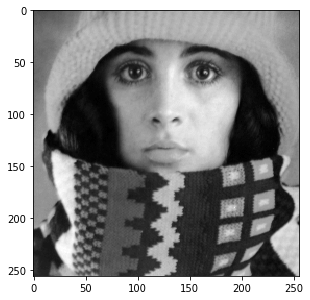
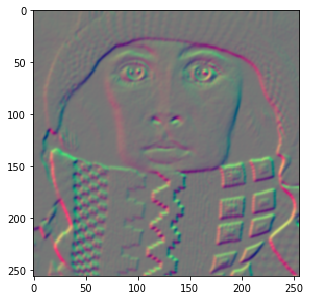
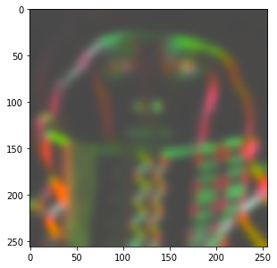
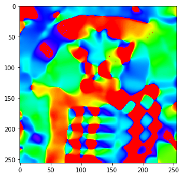
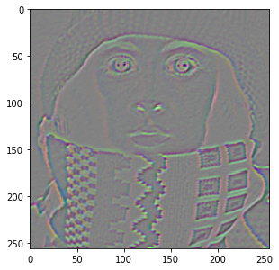

\comment (c)2017-2024, Cris Luengo.

\comment Licensed under the Apache License, Version 2.0 [the "License"];
\comment you may not use this file except in compliance with the License.
\comment You may obtain a copy of the License at
\comment
\comment    http://www.apache.org/licenses/LICENSE-2.0
\comment
\comment Unless required by applicable law or agreed to in writing, software
\comment distributed under the License is distributed on an "AS IS" BASIS,
\comment WITHOUT WARRANTIES OR CONDITIONS OF ANY KIND, either express or implied.
\comment See the License for the specific language governing permissions and
\comment limitations under the License.


\page pum_tensor_images Tensor images and color images

Images can have any number of channels, organized as either a vector or a matrix. We use the name
"tensor images" to encapsulate both of these concepts. A tensor is a generalization of matrix.
A rank-0 tensor is a single number, a scalar. A rank-1 tensor is a vector. A rank-2 tensor is a matrix.
Tensors can have any rank, but in the *DIPlib* library we are currently limited to ranks up to 2
(we have not seen higher rank tensors used in Image Analysis, if such a use arises, we can extend
the implementation to support those too).

Note that the image itself is not a matrix or a tensor. An image can be seen as a multi-dimensional
array, but we don't apply matrix multiplication or other linear algebra on the image as a matrix.
But each pixel can be a matrix, or a vector, and we can apply linear algebra on the pixels.

Images with a single channel, gray-scale images, are referred to as "scalar images" in *DIPlib*.

If the channels (i.e. tensor elements) are organized as a vector, it is a "vector image". Color images are
always vector images. Each pixel is a vector that represents a point in the color space.

Below we will see some example for rank-2 tensor images, such as the Hessian matrix and the Structure Tensor.


\section pum_tensor_images_examples Some example tensor images

This is a scalar image:
```python
img = dip.ImageRead('examples/trui.ics')
img.Show()
```


We can compute its gradient, which is a vector image:
```python
g = dip.Gradient(img)
g.Show()
```


The vector image is displayed by showing the first vector component in the red channel, and the second one in the green channel.
`g` has two components:
```python
g.TensorElements()  # == 2
g.TensorShape()     # == 'column vector'
```

Multiplying a vector image with its transposed leads to a symmetric matrix:
```python
S = g @ dip.Transpose(g)
```
`S.__repr__()` is
```none
<Tensor image (2x2 symmetric matrix, 3 elements), SFLOAT, sizes {256, 256}>
```
Note how the 2x2 symmetric matrix stores only 3 elements per pixel. Because of the symmetry, the `[0,1]` and the `[1,0]` elements
are identical, and need not be both stored. See \ref dip::Tensor::Shape for details on how the individual elements are stored.

Note also that the transposed image is not an image with spatial axes swapped, we transpose the vector or matrix at each pixel.

Local averaging of this matrix image (i.e. applying a low-pass filter) leads to the Structure Tensor:
```python
dip.Gauss(S, out=S, sigmas=5)
S.Show()
```


We can still display this tensor image, because it has only 3 tensor elements, which can be mapped to the three RGB channels of the display.

The Structure Tensor is one of the more important applications for the concept of the tensor image.
Here we show how to get the local orientation from it using the eigenvalue decomposition.
See \ref why_tensors for some more example applications of the Structure Tensor.
```python
eigenvalues, eigenvectors = dip.EigenDecomposition(S)
eigenvalues.TensorShape()   # == 'diagonal matrix'
eigenvectors.TensorShape()  # == 'column-major matrix'
```
The eigendecomposition is such that `S @ eigenvectors == eigenvectors @ eigenvalues`.
`eigenvectors` is a full 2x2 matrix, and hence has 4 tensor elements. These are stored in column-major order.
The first column is the eigenvector that corresponds to the first eigenvalue.
Eigenvalues are sorted in descending order, and hence the first eigenvector is perpendicular to the edges in the image.
```python
v1 = eigenvectors.TensorColumn(0)
angle = dip.Angle(v1)
angle.Show('orientation')
```


Note that extracting a column from the tensor yields a vector image, and that this vector image shares data with
the column-major matrix image. Transposing a matrix is a cheap operation that just changes the storage order of the matrix,
without a need to copy or reorder the data:
```python
tmp = dip.Transpose(eigenvectors)
tmp.TensorShape()             # == 'row-major matrix'
tmp.SharesData(eigenvectors)  # == True
```

A second important matrix image is the Hessian matrix, which contains all second order derivatives.
Just like the Structure Tensor, it is a symmetric 2x2 matrix:
```python
H = dip.Hessian(img)
H.Show()
```



\section pum_tensor_images_arithmetic Arithmetic with tensor images

We've already seen the matrix multiplication `@`. Other arithmetic operators are always applied on a per-sample basis:
addition `+` and subtraction `-`, multiplication `*`, division `/` and remainder `%`, exponentiation `**`,
bit-wise operators `&`, `|`, `^`, and comparison operators `==`, `!=`, `>`, `>=`, `<`, and `<=`.

For example, dividing `S` above by itself, `S / S`, yields a tensor image of the same sizes and shapes as `S`.
Each sample in the left-hand size is divided by the corresponding sample in the right-hand side.

But if we divide `S / eigenvectors`, where `S` has 3 samples organized as a symmetric 2x2 matrix, and `eigenvectors`
has 4 samples also organized as a 2x2 matrix, then the operation will see the two images as 2x2 matrices, and
will produce as output a full 2x2 matrix image (with 4 samples).

Finally, dividing `S / eigenvectors.TensorColumn(0)`, there is no way to match up the two tensor shapes,
so an exception is raised. There is no broadcasting (or singleton expansion as it's called in the *DIPlib* documentation)
for tensor elements, unless one of the images is a scalar: `S / eigenvectors(0)` works as expected.

Oftentimes, one needs to use a single pixel as one of the operands. For example, to add the same value to each pixel
in the image. We can of course use a scalar value: `g + 5`. To create a column vector pixel, simply provide a list:
`g + [1, 5]`. Because the `+` operator works element-wise, a row vector and a column vector can be added together:
`dip.Transpose(g) + [1, 5]`. But if one needs a matrix, or a row vector, it is a bit more complex to create.
For example, `g @ [[1, 5]]` does not work. Also, a *NumPy* array is interpreted as an image, not as a tensor pixel,
so cannot be used either. Instead, use the `dip.Create0D()` function:
```python
p1 = dip.Create0D([1, 5])                 # a column vector
p1.Transpose()                            # a row vector

p2 = dip.Transpose(dip.Create0D([1, 5]))  # also a row vector

p3 = dip.Create0D(np.array([[1, 5]]))     # also a row vector
```

To create a special tensor shape, you can use `dip.Image.ReshapeTensor()`:
```python
p4 = dip.Create0D([1.4, 0.5, -1.0])
p4.ReshapeTensor(dip.Tensor("symmetric matrix", 2, 2))
```


\section pum_tensor_images_color Color images

Color images are vector images where the vector represents a point within the gamut in the (3 or 4-dimensional)
color space.

When reading in a color image through *DIPlib* functions, the color space will typically be set correctly.
But if it isn't, you can manually set it:
```python
img = dip.Image((256, 256), 3)  # a 3-channel image
img.ColorSpace()                # == ''  (there's no color space set)
img.SetColorSpace('sRGB')       # define the image's color space
```
`dip.Image.SetColorSpace()` will overwrite whatever the current color space name is, it will not check that
the image has the right number of channels, and it will not touch the pixel data.

\ref dip::ColorSpaceManager is the class in the *DIPlib* library that takes care of color space conventions
and conversions. In *PyDIP*, `dip.ColorSpaceManager` is a sub-module that references an internally stored
global `dip::ColorSpaceManager` object. You can query the existence and properties of a color space,
but not define new ones (as that requires writing C++ code). `dip.ColorSpaceManager.Convert()` converts
from any known color space to any other color space, including gray scale. See \ref dip::ColorSpaceManager
for a list of currently known color spaces.

The conversion functions assume a specific gamut (each color space defines the range of the values for each channel).
These values do not change with the data type of the image. For example, a gray-scale image is assumed to be in
the range 0-255, whether the image is `UINT8`, `SINT16` or `DFLOAT`. But the range of values is irrelevant when
displaying, as the image display can scale data (see \ref pum_display). That is, the gamut is only relevant when
applying color space conversions.

```python
dip.ColorSpaceManager.IsDefined('L*a*b*')         # == True
dip.ColorSpaceManager.CanonicalName('L*a*b*')     # == 'Lab'
dip.ColorSpaceManager.NumberOfChannels('L*a*b*')  # == 3

img = dip.ImageRead('examples/DIP.tif')
img.ColorSpace()                                  # == 'sRGB'
out = dip.ColorSpaceManager.Convert(img, 'L*a*b*')
out.ColorSpace()                                  # == 'Lab'
```

Note that *PyDIP*'s image display will convert color images to sRGB for display, so you always see the colors
as they are intended.

It is also possible to set the white point, which will affect some color space conversions:
```python
dip.ColorSpaceManager.SetWhitePoint(dip.ColorSpaceManager.IlluminantD50)
out2 = dip.ColorSpaceManager.Convert(img, 'L*a*b*')
```
