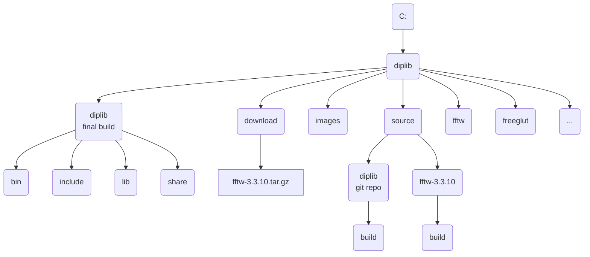

\comment Windows Release

\comment (c)2022, Ronald Ligteringen.

\comment Licensed under the Apache License, Version 2.0 [the "License"];
\comment you may not use this file except in compliance with the License.
\comment You may obtain a copy of the License at
\comment
\comment    http://www.apache.org/licenses/LICENSE-2.0
\comment
\comment Unless required by applicable law or agreed to in writing, software
\comment distributed under the License is distributed on an "AS IS" BASIS,
\comment WITHOUT WARRANTIES OR CONDITIONS OF ANY KIND, either express or implied.
\comment See the License for the specific language governing permissions and
\comment limitations under the License.

# Instructions for Windows release

*DIPlib* can be used as a C++ library linked to C++ code, via a Matlab interface and via a Python interface. The Python interface is build separately and is made available via PyPi. The Matlab interface (a.k.a. *DIPimage*) is build for macOS and Windows and is made available via GitHub Releases <https://github.com/DIPlib/diplib/releases>. Users are encouraged to build their own release of DIPlib and select which interface should be build for which platform. To aid with the build on Windows this document describes the steps taken for creating the release of the *DIPImage* for Windows.

## Setting up the file-structure

The following file-structure is used for building the Windows release:

*Note: round corners indicate directories, sharp corners indicate files* 

## Prerequisites

These instructions are written January 2022 and the following environment and programs have been used:

1. Windows 10 Enterprise, version 21H2
1. Git, version 2.34.1 <https://git-scm.com/download/win>
1. CMake, version 3.22.1 <https://cmake.org/download/#latest>
1. Microsoft Visual Studio Community 2022 (64-bit), version 17.0.5 <https://visualstudio.microsoft.com/downloads/>. Select the C++ environment during installation
1. OpenJDK, version 17.0.2 <https://jdk.java.net/17/>. It's sufficient to just unpack the `zip` file

Also the following dependencies have been downloaded:

1. FFTW, version 3.3.10 <https://fftw.org/download.html>. Download the source as we will build our own static library
1. FreeGlut, version 3.2.1 <http://freeglut.sourceforge.net/index.php#download>. Download the source as we will build our own static library
1. GLFW, version 3.3.6 <https://www.glfw.org/download.html>. Download the 64-bit Windows binaries as they also contain a prebuild static library
1. Freetype, version 2.11.1 <https://github.com/ubawurinna/freetype-windows-binaries/releases>. Download the `Source code (zip)` as is it also contains a prebuild static library
1. Bio-Formats package, version 6.8.1 <https://www.openmicroscopy.org/bio-formats/downloads/>. Download `bioformats_package.jar`

For some dependencies static libraries need to be build up front. For this `Visual Studio` and `CMake` need to be available.

### FFTW static library

1. unpack the download source
1. start CMake and select the directory of the unpacked source which contains `CMakeLists.txt`
  
1. press the `Configure` button and confirm the creation of the build directory. In the next window the generator will show the just install `Visual Studio` version which can be confirmed with the `Finish` button.
1. set and unset the variables in the main window as follows:
   - `BUILD_SHARED_LIBS` unset
   - `CMAKE_INSTALL_PREFIX` `c:\diplib\fftw`
   - `ENABLE_AVX` set
   - `ENABLE_AVX2` set
   - `ENABLE_OPENMP` set
   - `ENABLE_SSE` set
   - `ENABLE_SSE2` set
   - `ENABLE_THREADS` set
   - `WITH_COMBINED_THREADS` set
1. again press the `Configure` button to update the new values
  

*to be continued*