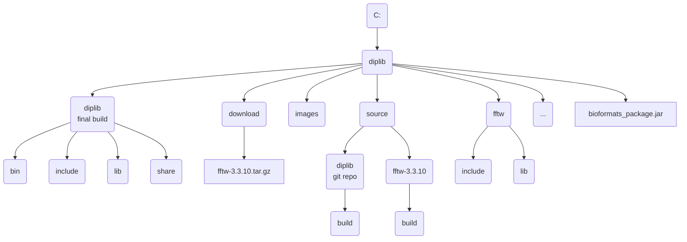

\comment Windows Release

\comment (c)2022, Ronald Ligteringen.

\comment Licensed under the Apache License, Version 2.0 [the "License"];
\comment you may not use this file except in compliance with the License.
\comment You may obtain a copy of the License at
\comment
\comment    http://www.apache.org/licenses/LICENSE-2.0
\comment
\comment Unless required by applicable law or agreed to in writing, software
\comment distributed under the License is distributed on an "AS IS" BASIS,
\comment WITHOUT WARRANTIES OR CONDITIONS OF ANY KIND, either express or implied.
\comment See the License for the specific language governing permissions and
\comment limitations under the License.

# Instructions for Windows release

*DIPlib* can be used as a C++ library linked to C++ code, via a Matlab interface and via a Python interface. The Python interface is build separately and is made available via PyPi. The Matlab interface (a.k.a. *DIPimage*) is build for macOS and Windows and is made available via GitHub Releases <https://github.com/DIPlib/diplib/releases>. Users are encouraged to build their own release of DIPlib and select which interface should be build for which platform. To aid with the build on Windows this document describes the steps taken for creating the release of the *DIPImage* for Windows.

## Setting up the file-structure

The following file-structure is used for building the Windows release (not all directories and files are specified):

*Note: round corners indicate directories, sharp corners indicate files*



## Prerequisites

These instructions are written January 2022 and the following environment and programs have been used:

1. Windows 10 Enterprise, version 21H2
1. Git, version 2.34.1 <https://git-scm.com/download/win>
1. CMake, version 3.22.1 <https://cmake.org/download/#latest>
1. Microsoft Visual Studio Community 2022 (64-bit), version 17.0.5 <https://visualstudio.microsoft.com/downloads/>. Select the C++ environment during installation
1. OpenJDK, version 17.0.2 <https://jdk.java.net/17/>. It's sufficient to just unpack the `zip` file

Also the following dependencies have been downloaded:

1. FFTW, version 3.3.10 <https://fftw.org/download.html>. Download the source as we will build our own static library (see [FFTW static library](#fftw-static-library))
1. GLFW, version 3.3.6 <https://www.glfw.org/download.html>. Download the 64-bit Windows binaries as they contain a prebuild static library
1. Freetype, version 2.11.1 <https://github.com/ubawurinna/freetype-windows-binaries/releases>. Download the `Source code (zip)` as is it contains a prebuild static library
1. Bio-Formats package, version 6.8.1 <https://www.openmicroscopy.org/bio-formats/downloads/>. Download `bioformats_package.jar`

### FFTW static library

To build the FFTW static libraries `Visual Studio` and `CMake` must be available.

For the FFTW library two versions need to be build: single precision `fftw3f.lib` and double precision `fftw3.lib` (for more information: <https://fftw.org/fftw3_doc/Precision.html>)

1. unpack the download source
1. start CMake and select the directory of the unpacked source which contains `CMakeLists.txt`
  
1. press the <kbd>Configure</kbd> button and confirm the creation of the build directory. In the next window the generator will show the just install `Visual Studio` version which can be confirmed with the `Finish` button.
1. for **double precision** set and unset the variables in the main window as follows:
   - `BUILD_SHARED_LIBS` unset
   - `CMAKE_INSTALL_PREFIX` `c:\diplib\fftw`
   - `ENABLE_AVX` set
   - `ENABLE_AVX2` set
   - `ENABLE_SSE` set
   - `ENABLE_SSE2` set
   - `ENABLE_THREADS` set
   - `WITH_COMBINED_THREADS` set
1. again press the <kbd>Configure</kbd> button to update the new values
  
1. press the <kbd>Generate</kbd> button to generate the build files for Visual Studio
1. close all running versions of Visual Studio and then press the <kbd>Open Project</kbd> button to start a new version of Visual Studio with the created build files
1. switch to Visual Studio and set the Solution Configuration to `Release`, see screenshot:
  
1. right-click on the `INSTALL` solution in the Solution Explorer and select `Build`, see screenshot:
  
  
1. return to CMake
1. for **single precision** only set the following variable:
   - `ENABLE_FLOAT` set
1. press the <kbd>Configure</kbd>
1. press the <kbd>Generate</kbd>
1. switch to Visual Studio and select the Reload option
1. right-click on the `INSTALL` solution

## Building *DIPimage*

The *DIPlib* source used for building *DIPimage* can be retrieved from the GitHub-repository: <https://github.com/DIPlib/diplib>.

The next chapter describes briefly the steps to authenticate from Windows to GitHub with an ssh-keypair.

### Setting up GitHub SSH authentication

Pushing to and pulling from GitHub requires authentication. This is done with an ssh-keypair without a password to speed up the process. First the ssh-keypair is created and shared with GitHub. Secondly Windows is setup to store the private key in memory after each login.

#### Store new ssh-key in GitHub

1. open `Git Bash`
1. enter the following command to create an ssh-keypair without passphrase:

   ```bash
   $ ssh-key -f ~/.ssh/github -N ""
   ```

3. copy the contents of the **public** key `~/.ssh/github.pub`
1. open GitHub website and navigate to `Settings` in the user-menu in the upper-right
1. select on the left `SSH and GPG keys` and press the <kbd>New SSH key</kbd> button
1. paste the public key in the `Key` field and press the <kbd>Add SSH key</kbd> button

#### Save ssh-key in Windows

The private part of the ssh-key is stored in memory at login in the ssh-agent.

1. open `Services`
1. right-click on `OpenSSH Authentication Agent` and select `Properties`
1. set `Startup type` to `Automatic` and click <kbd>Apply</kbd>
1. click on the <kbd>Start</kbd> button close window with <kbd>OK</kbd>
1. create `ssh_add_github.bat` with the following content:

   ```bat
   ssh-add.exe "C:\Users\<username>\.ssh\github"
   ```
1. store the `ssh_add_github.bat` file in the user startup directory: ` %appdata%\Microsoft\Windows\Start Menu\Programs\Startup`

*to be continued*