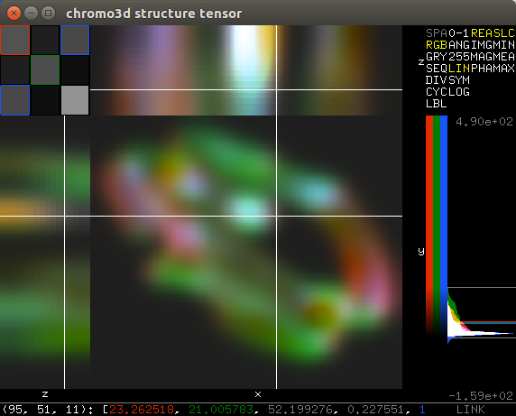

\comment (c)2017, Wouter Caarls.

\comment Licensed under the Apache License, Version 2.0 [the "License"];
\comment you may not use this file except in compliance with the License.
\comment You may obtain a copy of the License at
\comment
\comment    http://www.apache.org/licenses/LICENSE-2.0
\comment
\comment Unless required by applicable law or agreed to in writing, software
\comment distributed under the License is distributed on an "AS IS" BASIS,
\comment WITHOUT WARRANTIES OR CONDITIONS OF ANY KIND, either express or implied.
\comment See the License for the specific language governing permissions and
\comment limitations under the License.


\group dipviewer *DIPviewer*
\ingroup display
\brief Interactive image display.

\section viewer_introduction Introduction

*DIPlib* includes an *OpenGL*-based image viewer to help in the visualization
of intermediate results. Its main purpose is as a debugging tool. It exists
in its own library, which must be linked separately if used. The
viewer contains two main classes

1. \ref dip::viewer::ImageViewer, to visualize 2D 8-bit RGB images
2. \ref dip::viewer::SliceViewer, to visualize 2D slices of nD (tensor) images

More than one viewer can be active at the same time, and the separate
windows are managed by a primitive window manager. Two libraries are
supported for window management:

1. **GLUT** (\ref dip::viewer::GLUTManager):
   The venerable *OpenGL Utility Toolkit*, in the form of
   [*FreeGLUT*](http://freeglut.sourceforge.net).

2. **GLFW** (\ref dip::viewer::GLFWManager):
   [*GLFW*](http://www.glfw.org/) is more modern than *GLUT*, and better supported
   by MacOS. Its disadvantage is that it requires the user to poll an event handler
   from the main thread of the program, something that is baked into the MacOS
   *Cocoa* framework.

To use the \ref dip::viewer::ImageViewer, the image must first be converted to 8-bit RGB,
for example using the \ref dip::ImageDisplay class. It does not have a user
interface, and just shows the image.

\section viewer_ui User interface



\ref dip::viewer::SliceViewer is more elaborate. Its user interface consists of four
main parts: The main visualization window, the control panel, the histogram,
and the status bar.

\subsection viewer_main_window Main visualization window

  The main visualization window on the left shows three projections,
  nominally XY, XZ and YZ. The upper left corner visualizes the different
  tensor elements.

\subsection viewer_control_panel Control panel

  The control panel allows the user to select different ways of visualizing
  the image. It consists of four lists of options:

  1. *Color space*, being

     - *SPA*: image color space; this disregards the mapping.
     - *RGB*: RGB color space, from any 3 tensor elements.
     - *GRY*: Single grey value.
     - *SEQ*: Single value mapped to a sequential blue-yellow colormap.
     - *DIV*: Single value mapped to a divergent blue-red colormap. Use for symmetric mappings.
     - *CYC*: Single value mapped to a cyclic colormap. Use for angles.
     - *LBL*: Single value mapped to sequentially disparate colors. Use for labels.

  2. *Mapping*, being

     - *0-1*: Unit values.
     - *ANG*: Data between [-&pi;, &pi;].
     - *255*: 8-bit data.
     - *LIN*: Linear interpolation between the global minimum and maximum values.
     - *SYM*: Linear interpolation that is symmetric around 0.
     - *LOG*: Logarithmic mapping.

  3. *Complex mapping*, being

     - *REA*: Real part.
     - *IMG*: Imaginary part.
     - *MAG*: Magnitude.
     - *PHA*: Phase.

  4. *Projection*, being

     - *SLC*: Single slice around operating point.
     - *MIN*: Minimum over dimensions perpendicular to slice.
     - *MEA*: Mean over dimensions perpendicular to slice.
     - *MAX*: Maximum over dimensions perpendicular to slice.

\subsection viewer_histogram Histogram

  The histogram shows both the frequency of intensities (100 bins between
  global minimum and maximum values), as well as the minimum and maximum
  values themselves. The colorbar left of the histogram shows how these
  values are mapped in the main visualization window. Changing the mapping
  in the control panel does not change the histogram extents, but does
  change the colorbar.

  The histogram also indicates the value of the operating point and the
  current mapping range.

\subsection viewer_status_bar Status bar

  The status bar gives the current pixel value, and shows option values
  after you change them.

\subsection interaction Interaction

Interaction occurs mainly within the main visualization window, and depends
on where it occurs:

\subsubsection interaction_tensor Tensor elements

Within the tensor visualization subwindow, left-clicking selects the
tensor element to visualize. If the RGB color space is chosen,
left-clicking allocates the next available color (R, G or B) until three
elements have been selected. Left-clicking on an already selected element
deselects it.

\subsubsection interaction_slices Slices

Left-clicking in a slice changes the operating point for the visualized
dimension(s). If slice projection is used, this will also affect the
slices that are being visualized in the other projections.

Shift-left-dragging sets the projection ROI. The ROI edge closest to the
cursor is selected to be moved. This is only available when minimum, mean,
or maximum projection is used.

Middle-dragging gives some limited control over the relative sizes of the
three projections.

Right-dragging moves the slice, which is convenient when zooming in.

Scroll wheel zooms in and out, centering in the current cursor position.
Zooming in on the ancillary windows (nominal XZ and YZ) only zooms the Z
dimension relatively.

\subsubsection interaction_labels Slice labels

Right-clicking on a slice label changes the visualized dimension for that
projection. In the special case of selecting '-', a 1D slice is shown.
Note that the horizontal dimensions of the nominal XY and XZ slices are
necessarily the same, as are the vertical dimensions of the nominal XY and
YZ slices.

Zooming near the slice labels only zooms that dimension.

\subsubsection interaction_histogram Histogram

Left-dragging in the histogram changes the mapping range limits.

\subsubsection interaction_status_bar Status bar

To the right of the status bar is the Link indicator, which can be used to link
to other windows. Simply click the indicator in the source window, and
then in the destination window. Operating point, zoom and offset will then be
shared between the windows. Right-click to unlink.

There are also a few keyboard shortcuts:

- **D**{ .m-label .m-warning } and **A**{ .m-label .m-warning }:
  Step through the first image dimension.

- **S**{ .m-label .m-warning } and **W**{ .m-label .m-warning }:
  Step through the second image dimension.

- **N**{ .m-label .m-warning } and **P**{ .m-label .m-warning }:
  Step through the third image dimension.

- **F**{ .m-label .m-warning } and **B**{ .m-label .m-warning }:
  Step through the fourth image dimension.

- **1**{ .m-label .m-warning } through **0**{ .m-label .m-warning }:
  Select tensor element (first element is leftmost).

- **Ctrl**{ .m-label .m-warning } + **1**{ .m-label .m-warning }:
  Sets a 1:1 image pixel to screen pixel zoom for all dimensions.

- **Ctrl**{ .m-label .m-warning } + **F**{ .m-label .m-warning }:
  Sets the image to fill the screen area, but maintaining the XY aspect
  ratio. The zoom of non-visualized dimensions is reset to 1.

- **Ctrl**{ .m-label .m-warning } + **L**{ .m-label .m-warning }:
  Sets linear mapping between global minimum and maximum values.

- **Ctrl**{ .m-label .m-warning } + **N**{ .m-label .m-warning }:
  Creates a linked clone of the current viewer. Convenient when wanting to
  display different tensor elements, mappings, etc.

- **Ctrl**{ .m-label .m-warning } + **R**{ .m-label .m-warning }:
  Resets the projection ROI.

- **Ctrl**{ .m-label .m-warning } + **W**{ .m-label .m-warning }:
  Closes the current window.

- **Ctrl**{ .m-label .m-warning } + **Shift**{ .m-label .m-warning } + **W**{ .m-label .m-warning }:
  Closes all windows.

\section viewer_example Usage example

The viewer is most easily used through the \ref dip::viewer namespace. Simply
call

```cpp
dip::viewer::Show( image );
```

after including \ref "dipviewer.h" to show an image in the slice viewer. After
all images have been shown this way, you can call

```cpp
dip::viewer::Spin();
```

to enable mouse interaction. If you wish to continue your program, you must
instead call

```cpp
dip::viewer::Draw();
```

periodically. Make sure to call \ref dip::viewer::Spin when you're done to
ensure a clean exit.

See `examples/cpp/viewer.cpp` for a usage example of the full interface.
